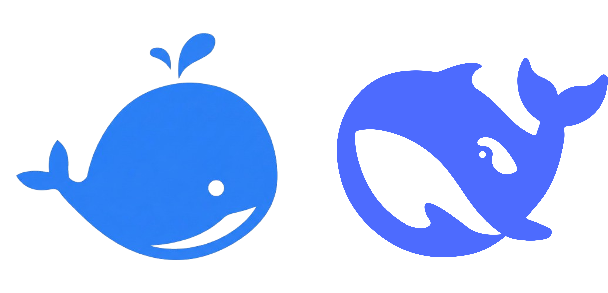

   
  <h1>Unlock DeepSeek</h1>
  <h3>DeepSeek Series Paper Interpretation and Hands-on Reproduction</h3>
  
<em>Interpreting, expanding, and reproducing DeepSeek's series of works for a wide audience of AI researchers. Dedicated to disseminating DeepSeek's cutting-edge innovations on the path to AGI.</em>

  
  
  
  
    <h4 align="center">
       <b>English</b> | <a href="https://github.com/datawhalechina/unlock-deepseek/blob/main/README.md">简体中文</a>
</h4>

---

## 📖 Project Introduction

**Unlock DeepSeek** is an open-source learning project for AI researchers and learners, dedicated to **systematic interpretation** and **hands-on reproduction** of the DeepSeek series of papers. The project covers DeepSeek's innovations in general-purpose large language models, mathematical reasoning, code generation, multimodal understanding, reasoning models (e.g., DeepSeek-R1), MoE architecture, and training infrastructure, aiming to break down DeepSeek's frontier technologies into understandable and reproducible learning content.

**Core Features:**
- **Paper Deep Dive**: Systematic interpretation of the full series of technical reports from DeepSeek-LLM to DeepSeek-V3.2, DeepSeek-Math, DeepSeek-Coder, DeepSeek-VL, and more
- **Hands-on Practice**: Step-by-step reproduction tutorials and code from scratch, with localized reproduction support for the Chinese community (e.g., DeepSeek-R1)
- **Technical Breakdown**: Focus on MoE architecture, reasoning models (CoT/MCTS/GRPO, etc.), data, and Infra as key elements
- **Comparative Analysis**: Introduction of related works such as Kimi, GLM，MiniMax to present different technical approaches on the path to AGI

**Target Audience**: Beginners with foundational knowledge in large language models and university-level mathematical skills, learners interested in understanding deep reasoning, and professionals looking to apply reasoning models in their work.

**The project is currently in ⚠️ Alpha testing; it is incomplete and may contain errors.**

## 📚 Structure Preview

| Chapter | Summary | Status |
| ------------------------------------------------------- | ---------------------------- | ---- |
| [Introduction]() | Project overview and learning recommendations | ✅ |
| **General Large Language Models** | | |
| [DeepSeek-LLM]() | Scaling Open-Source Language Models with Longtermism | 🚧 |
| [DeepSeekMoE]() | Towards Ultimate Expert Specialization in Mixture-of-Experts Language Models | 🚧 |
| [DeepSeek-V2]() | A Strong, Economical, and Efficient Mixture-of-Experts Language Model | 🚧 |
| [DeepSeek-V3]() | DeepSeek-V3 Technical Report | 🚧 |
| [DeepSeek-V3.2]() | Pushing the Frontier of Open Large Language Models | 🚧 |
| [DeepSeek-V3.2-Exp]() | Boosting Long-Context Efficiency with DeepSeek Sparse Attention | 🚧 |
| **Mathematics** | | |
| [DeepSeek-Math]() | Pushing the Limits of Mathematical Reasoning in Open Language Models | 🚧 |
| [DeepSeek-Math-V2]() | Towards Self-Verifiable Mathematical Reasoning | 🚧 |
| [DeepSeek-Prover]() | Advancing Theorem Proving in LLMs through Large-Scale Synthetic Data | 🚧 |
| [DeepSeek-Prover-V1.5]() | Harnessing Proof Assistant Feedback for Reinforcement Learning and Monte-Carlo Tree Search | 🚧 |
| [DeepSeek-Prover-V2]() | Advancing Formal Mathematical Reasoning via Reinforcement Learning for Subgoal Decomposition | 🚧 |
| **Code** | | |
| [DeepSeek-Coder]() | Let the Code Write Itself | 🚧 |
| [DeepSeek-Coder-V2]() | Breaking the Barrier of Closed-Source Models in Code Intelligence | 🚧 |
| **Multimodal** | | |
| [DeepSeek-OCR]() | Contexts Optical Compression | 🚧 |
| [DeepSeek-OCR-2]() | Visual Causal Flow | 🚧 |
| [DeepSeek-VL]() | Towards Real-World Vision-Language Understanding | 🚧 |
| [DeepSeek-VL2]() | Mixture-of-Experts Vision-Language Models for Advanced Multimodal Understanding | 🚧 |
| [Janus]() | Decoupling visual encoding for unified multimodal understanding and generation | 🚧 |
| [JanusFlow]() | Harmonizing Autoregression and Rectified Flow for Unified Multimodal Understanding and Generation | 🚧 |
| [Janus-Pro]() | Unified Multimodal Understanding and Generation with Data and Model Scaling | 🚧 |
| **Reasoning Models / Reinforcement Learning** | | |
| [DeepSeek-R1](./DeepSeek-R1/) | Incentivizing Reasoning Capability in LLMs via Reinforcement Learning | ✅ |
| **Model Architecture & Training Methods** | | |
| [Engram]() | Conditional Memory via Scalable Lookup | 🚧 |
| [FlashMLA]() | Efficient Multi-head Latent Attention Kernels | 🚧 |
| [LPLB]() | Linear-Programming-Based Load Balancer | 🚧 |
| [ESFT]() | Expert-Specialized Fine-Tuning for Sparse Architectural Large Language Models | 🚧 |
| **INFRA** | | |
| [DualPipe]() | | 🚧 |
| [3FS]() | | 🚧 |
| [DeepEP]() | | 🚧 |
| [DeepGEMM]() | | 🚧 |
| **Appendix** | | |
| [Appendix]() | | ✅ |

## 🤝 Project Members

Thanks to the following core contributors, in no particular order:

- [XiuTao Luo - Project Lead](https://github.com/anine09) (SiLiang Lab)
- [ShuFan Jiang - Project Lead](https://github.com/Tsumugii24) (Datawhale)
- [Kaijun Deng](https://github.com/kedreamix) (Shenzhen University)
- [JiaNuo Chen](https://github.com/Tangent-90C) (Guangzhou University)
- [JingHao Lin](https://github.com/linjh1118) (Zhipu.AI)

## 🙏 Acknowledgments

This project benefits from [DeepSeek-R1](https://github.com/deepseek-ai/DeepSeek-R1), [Open-R1](https://github.com/huggingface/open-r1), [transformers](https://github.com/huggingface/transformers), [pytorch](https://github.com/pytorch/pytorch), [flash-attn](https://github.com/Dao-AILab/flash-attention), [trl](https://github.com/huggingface/trl), [mini-deepseek-r1](https://www.philschmid.de/mini-deepseek-r1), [TinyZero](https://github.com/Jiayi-Pan/TinyZero), [modelscope](https://github.com/modelscope/modelscope), [vllm](https://github.com/vllm-project/vllm). We thank the above open-source projects for their outstanding work!

## 📜 License

This project is licensed under the [Creative Commons Attribution-NonCommercial-ShareAlike 4.0 International License](http://creativecommons.org/licenses/by-nc-sa/4.0/).
